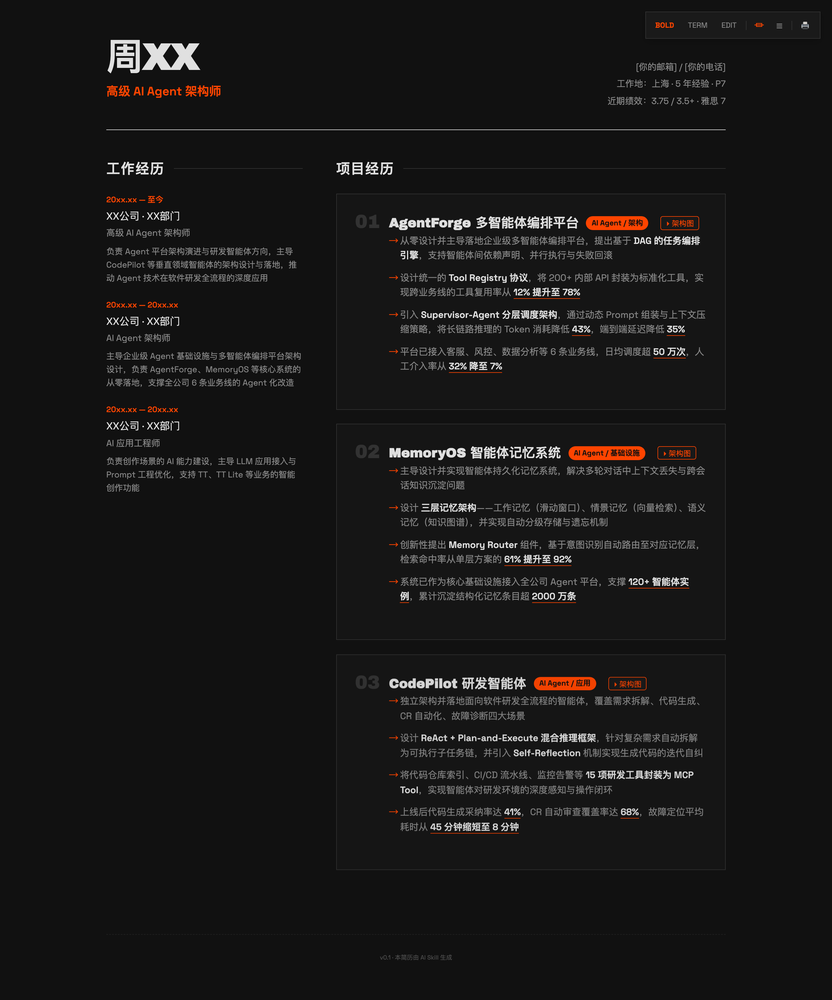
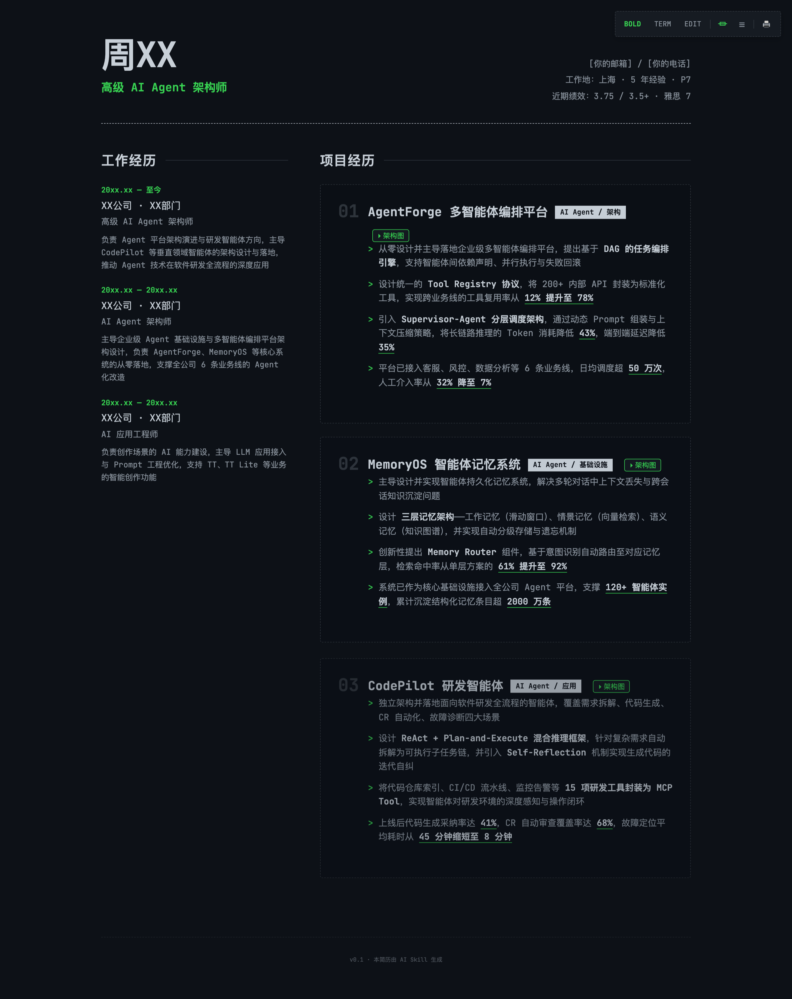
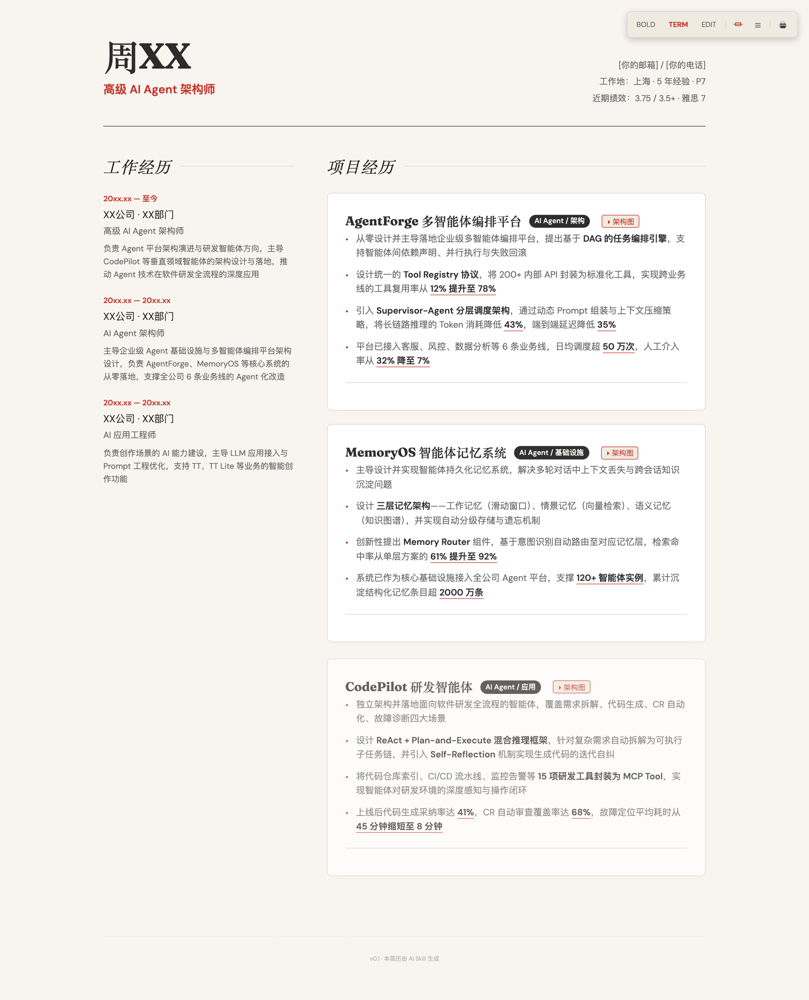

# Frontend CV

A universal AI agent skill for generating advanced, print-friendly, multi-theme HTML resumes from structured Markdown files. Works with Trae IDE, Claude Code, and other agent platforms.

<p align="center">
  
</p>

## What This Does

Frontend CV converts a set of structured Markdown files (or pasted text) into a polished, responsive, and print-ready HTML resume — a single self-contained file with no external dependencies.

It supports **3 distinctive themes**, **auto-generated SVG architecture diagrams** for project experience, and **single/double column layout** switching.

### Bold Signal | Terminal Green | Editorial

<p align="center">
  
  
  
</p>

## Key Features

- **Zero Dependencies** — Single HTML file with inline CSS/JS. No npm, no build tools, no frameworks.
- **3 Curated Themes** — Bold Signal (dark, high-impact), Terminal Green (hacker aesthetic), Editorial (elegant, light). No generic AI aesthetics.
- **SVG Architecture Diagrams** — Auto-generate theme-adaptive architecture diagrams for project experience, with modal split-view display.
- **Layout Switching** — Toggle between single-column and double-column layouts with one click.
- **Print-Ready** — Dedicated `@media print` styles. Just hit Ctrl+P.
- **Scroll Animations** — Staggered reveal animations via IntersectionObserver.

## Installation

### For Trae IDE

Clone to the global skills directory so the skill is available across all projects:

```bash
git clone https://github.com/luoyixin2019/frontend-cv.git ~/.trae/skills/frontend-cv
```

Or clone as a project and create a symlink:

```bash
git clone https://github.com/luoyixin2019/frontend-cv.git ~/code/frontend-cv
ln -s ~/code/frontend-cv ~/.trae/skills/frontend-cv
```

Then invoke it by typing `/frontend-cv` in Trae IDE.

### For Claude Code

Clone to the Claude Code skills directory:

```bash
git clone https://github.com/luoyixin2019/frontend-cv.git ~/.claude/skills/frontend-cv
```

Then invoke it by typing `/frontend-cv` in Claude Code.

### For Other Agents (Cursor, Windsurf, etc.)

Copy `SKILL.md` and the `template/` directory to your agent's skill/rules directory, then reference it in your agent's configuration. The skill uses only relative paths and standard tool descriptions (Read, Write, LS), so it works with any agent that supports skill files.

## Usage

### Generate a Resume from Markdown Files

```
/frontend-cv

> "Generate my resume from ./src/demo/"
```

The skill will:

1. Ask how you want to provide data (paste or file path)
2. Ask whether to auto-generate architecture diagrams for projects
3. Parse your Markdown into structured sections
4. Generate SVG diagrams (if requested)
5. Produce a single-file HTML resume with all CSS/JS embedded

### Data Source

Provide resume data in one of two ways:

- **Paste content** — Directly paste resume text in the chat
- **File/folder path** — Provide a path to a `.txt`, `.md`, `.html` file, or a folder containing:
  - `basics.md` — Name, contact, experience, level, tech stack
  - `education-experience.md` — Education history
  - `working-experience.md` — Work history
  - `project-experience.md` — Project details

See `src/demo/` for an example.

## Included Themes

### Bold Signal (Default)

Confident, high-impact. Vivid orange accent on dark background. Sharp edges, no border-radius.

### Terminal Green

Developer-focused, hacker aesthetic. Green-on-dark with dashed borders and monospace fonts.

### Editorial

Elegant, sophisticated. Cream background with classic red accent. Serif display font, rounded corners.

## Architecture

This skill uses a flat directory structure — all skill files are at the repository root for maximum portability across agent platforms.

| File                 | Purpose                                                 | Loaded When               |
| -------------------- | ------------------------------------------------------- | ------------------------- |
| `SKILL.md`           | Core workflow and rules                                 | Always (skill invocation) |
| `template/style.css` | Theme definitions, layout, print styles, SVG adaptation | Generation phase          |
| `template/script.js` | Theme/layout switching, scroll animations               | Generation phase          |

```
frontend-cv/
├── SKILL.md                      # Skill definition (agent-agnostic)
├── template/
│   ├── style.css                 # All themes + layout + print + SVG adaptation
│   └── script.js                 # Theme/layout switcher + animations
├── scripts/
│   ├── screenshot.js             # Capture theme preview screenshots
│   ├── export-pdf.sh             # Export resume to PDF
│   └── deploy.sh                 # Deploy resume to Vercel URL
├── docs/                         # Theme preview images
├── src/
│   └── demo/                     # Example resume data
│       ├── basics.md
│       ├── education-experience.md
│       ├── working-experience.md
│       ├── project-experience.md
│       └── proj_svg/             # Generated architecture diagrams
└── res/
    └── demo/
        └── resume.html           # Generated output
```

## Sharing Your Resume

After generating a resume, two scripts are available for sharing:

### Export to PDF

Convert your resume to a PDF for email, Slack, or printing:

```bash
bash scripts/export-pdf.sh ./res/demo/resume.html
bash scripts/export-pdf.sh ./resume.html ./my-resume.pdf
```

Uses Playwright to render the page and export as A4 PDF. Installs automatically if needed. Animations are not preserved (static snapshot).

### Deploy to a Live URL

Deploy your resume to a permanent, shareable URL that works on any device:

```bash
bash scripts/deploy.sh ./res/demo/resume.html
```

Uses Vercel (free tier). The script walks you through signup and login if it's your first time.

## Philosophy

- **Single file, zero maintenance.** A self-contained HTML file will work in 10 years. A React project from 2019? Good luck.
- **Design by reaction, not description.** Switch themes with one click and pick what feels right.
- **Architecture diagrams tell the story.** A well-crafted SVG diagram communicates more than paragraphs of text.
- **Print is not an afterthought.** Resumes are meant to be printed. Dedicated print styles ensure clean output.
- **Agent-agnostic by design.** No hardcoded paths, no platform-specific tooling. Works everywhere.

## Requirements

- An AI agent that supports skill files (Trae IDE, Claude Code, Cursor, etc.)
- For PDF export: Node.js + Playwright (installs automatically)
- For URL deployment: Node.js + Vercel account (free)

## License

MIT — Use it, modify it, share it.
